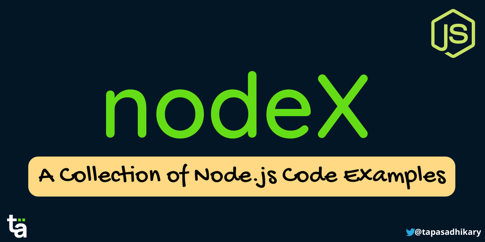

# nodeX

  

`nodeX` is an `OpenSource` project to capture working code examples for various node.js modules.

It is aimed to help Node.js developers with code examples. Please contribute to the project, whatever ways possible.

Liked the motive? Please give a star(⭐) to the project.

### Many Thanks to all the `Stargazers` who has supported this project with stars(⭐)

## ToC

- [Node.js File System Module Code Examples](./fs-module)
- [Node.js HTTP Module Code Example](./http-module)
- [Node.js HTTPS Module Code Example](./https-module)
- [Node.js URL Module Code Example](./url-module)
- [Node.js Assert Module Code Example](./assert-module)
